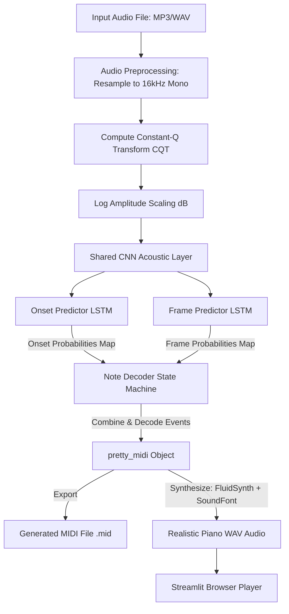

# 🎹 Piano Transcription AI

A PyTorch-based Deep Learning project that converts piano audio recordings (MP3, WAV, etc.) into clean, structured MIDI files. The project includes a shared CNN-LSTM network for transcription, a custom peak-detection state machine to decode notes, and a Streamlit web app that lets you upload audio, download the MIDI, and play back the synthesized piano music directly in your browser.

---

## 📊 How the System Works (Project Flow)

The diagram below shows the complete pipeline of the project, from uploading raw audio to outputting a playable synthesized piano file:



---

## 📅 Dataset & Preprocessing

### 1. The Google MAESTRO Dataset
We used the **Google MAESTRO Dataset (v3.0.0)** for training and validation. It is one of the best datasets for piano transcription because it contains over **200 hours** of classical piano performances. The audio is recorded directly from Yamaha Disklavier pianos, which simultaneously capture the exact MIDI data of the performance. This provides perfect alignment between the audio wave and the ground truth notes.

### 2. Why Preprocess on Google Colab?
The raw audio files in the dataset take up over **80 GB** of space in WAV format. Downloading and processing 80 GB of audio on a standard laptop would take days and run out of memory. 

To solve this, we used **Google Colab** to preprocess the data:
1. **Cloud-to-Cloud Download**: We downloaded the dataset directly from Google Cloud Storage to our Colab virtual machine in minutes.
2. **CQT Extraction**: We ran feature extraction on Colab's high-speed CPU/GPU and converted all audio into CQT features.
3. **Data Compression**: We packed the CQT features along with target frames and target onsets into compact `.npz` files for each song.
4. **Preprocessed ZIP**: We zipped these preprocessed files into a single `maestro_preprocessed_complete.zip` (~12.9 GB compressed).
5. **No Local Audio Setup Required**: If you want to train the model locally, you don't need to do any heavy audio processing or download the 80 GB raw audio. You just download the 13 GB preprocessed zip, extract it to the [maestro_preprocessed_complete/](maestro_preprocessed_complete) folder, and run the training code immediately.

### 3. Understanding the Constant-Q Transform (CQT)
Instead of standard Fast Fourier Transforms (FFT) or Mel Spectrograms, we use the **Constant-Q Transform (CQT)**:
* Standard FFT uses linearly spaced frequency bins, which doesn't align well with music because musical notes are spaced logarithmically (each octave doubles in frequency).
* CQT uses logarithmically spaced bins, where each bin matches a specific musical pitch.
* We set our CQT to have exactly **88 bins** starting at frequency **C1**, with **12 bins per octave**. This means each bin in our input spectrogram corresponds exactly to one of the 88 keys on a standard piano keyboard, making it much easier for the neural network to map frequencies to notes.

---

## 🧠 Neural Network Architecture

Our neural network, defined in [streamlit_app.py](streamlit_app.py#L14), is a PyTorch model based on the **"Onsets and Frames"** architecture. It breaks piano transcription into two easier tasks instead of trying to predict everything at once:

### 1. Shared CNN Acoustic Layer
The model takes the log-amplitude CQT spectrogram (shape: `[Batch, 1, 88, TimeFrames]`) and treats it like a single-channel image. It passes through two Convolutional layers (`conv1` and `conv2`) with Batch Normalization and ReLU activations. This layer extracts features like harmonic relations (vertical patterns) and sustain durations (horizontal patterns) from the audio spectrum.

### 2. Onset Predictor Head
* **What it does**: Predicts the exact moment a piano key is struck.
* **How it works**: It takes the CNN features and passes them through a Bidirectional LSTM (256 units). The output goes to a Fully Connected (FC) layer with a Sigmoid activation, yielding an onset probability map (values between 0 and 1) for all 88 keys across all time frames.
* **Why it is Bidirectional**: Bidirectional LSTMs process the audio sequence forward and backward. This allows the model to look at the "future" context (like the tail of a note) to decide if a note started in the past.

### 3. Frame Predictor Head
* **What it does**: Predicts whether a note is currently held down or sustained.
* **How it works**: It takes the CNN features and **concatenates** (joins) them with the predicted probabilities from the Onset Predictor. It passes this combined input through a separate Bidirectional LSTM (256 units) and an FC layer with Sigmoid activation to predict active note frames.
* **Why we concatenate**: The start of a note (onset) is loud and distinct, but the middle/end of a note decays and blends in with other notes. By feeding the predicted onsets directly into the Frame Predictor, the model learns that a note can only be sustained if it was recently struck.

---

## 📈 Training & Loss Configuration

The training configuration is implemented in [train.ipynb](train.ipynb):

### 1. Handling Class Imbalance (Weighted Loss)
In a piano performance, most of the 88 keys are silent at any given millisecond. This means the target matrices are filled mostly with `0`s and very few `1`s (onsets are especially sparse, occurring in only 1-2 frames per note strike). If a model simply predicts `0` for everything, it would achieve over 98% accuracy but transcribe nothing.

To fix this, we use a custom [TranscriptionLoss](train.ipynb#L91) that uses weighted Binary Cross-Entropy (BCE):
* **Onset Positive Weight**: Set to `10.0`. This tells the loss function that missing an onset (predicting 0 instead of 1) is 10 times worse than predicting a false onset.
* **Frame Positive Weight**: Set to `3.0` to balance the active vs. inactive sustain frames.
* **Joint Loss Calculation**:
  $$\text{Loss}_{\text{total}} = 5.0 \cdot \text{Loss}_{\text{onset}} + 1.0 \cdot \text{Loss}_{\text{frame}}$$
  We multiply the onset loss by 5.0 because accurate onset detection is the most critical factor in creating a clean, professional MIDI output.

### 2. Optimization Details
* **Optimizer**: Adam optimizer with a learning rate of `0.001` and weight decay of `1e-5`.
* **Gradient Clipping**: We clip gradients at a maximum norm of `1.0` (`torch.nn.utils.clip_grad_norm_`) before each step. This prevents the gradients from growing too large ("exploding gradients"), which is a common failure mode in LSTM networks.
* **Learning Rate Scheduler**: We use `ReduceLROnPlateau` with a patience of 3 epochs. If the validation loss stops improving for 3 epochs, it automatically halves the learning rate to help the model converge smoothly.

---

## ⚙️ Note Decoding State Machine

Raw probability outputs from the neural network are continuous values between 0 and 1. If we just use a basic threshold (e.g., "if probability > 0.5, note is ON"), the notes will flicker on and off rapidly due to noise, and we won't be able to tell if a key was tapped twice quickly or held down.

To create clean MIDI notes, we decode predictions using a state machine:

1. **Detecting Note Starts (Onsets)**:
   We look at the onset probability map. A note is triggered only if the probability at frame $t$ is above `ONSET_THRESHOLD = 0.35` **and** is a local peak. A frame is a local peak if:
   $$P(t) \ge P(t-1) \quad \text{and} \quad P(t) > P(t+1)$$
   This ensures we capture the note exactly at its loudest impact.

2. **Tracking Note Holds (Frames)**:
   Once a note starts, it remains active. We check the frame probability map for that key. The note stays active as long as the frame probability is above `FRAME_THRESHOLD = 0.20`. Once it drops below 0.20, we turn the note OFF.

3. **Handling Repeated Strikes (De-bouncing)**:
   If a note is already active and the model detects a new onset peak on the *same key*, we know the pianist struck the key again. We stop the current note half a frame early (to create a tiny gap so they don't merge) and immediately start a new note. We add a 2-frame "de-bounce" window to prevent double-triggering on the exact same strike.

4. **Filtering Ghost Notes**:
   Any note event that is shorter than **30 milliseconds** is deleted. This filters out short, clicky noise artifacts predicted by the network.

---

## 🔊 Audio Synthesis & FluidSynth

MIDI files do not contain actual sound waves; they only store instructions (e.g., "Play note 60 at time 1.5s with volume 100, and release it at time 3.0s"). To hear the transcription in the browser:

1. **FluidSynth**: We load the generated MIDI into FluidSynth, a software synthesizer.
2. **SoundFont (`.sf2`)**: We use a high-quality piano SoundFont (`Steinway Grand Piano 1.2.sf2`). A SoundFont is a collection of real, recorded audio samples of a Steinway grand piano. FluidSynth matches the MIDI instructions to these samples, adjusts their pitch and volume, and creates a realistic piano WAV file.
3. **Fallback Synth**: If FluidSynth is not installed on the user's computer, [streamlit_app.py](streamlit_app.py) falls back to a custom math-based synthesizer. It generates pure sine waves for the active frequencies and applies a simple volume envelope (a fast linear volume ramp-up for the "attack" and a gradual fade-out for the "decay") so that it still sounds musical.

---

## 🛠️ Installation & Setup

### 1. Install System Libraries (FluidSynth)
*   **macOS**:
    ```bash
    brew install fluidsynth
    ```
*   **Ubuntu / Debian**:
    ```bash
    sudo apt update
    sudo apt install fluidsynth
    ```
*   **Windows**:
    Download the binaries from the [FluidSynth GitHub Releases Page](https://github.com/FluidSynth/fluidsynth/releases) and add the `bin/` directory path to your system environment variables (`PATH`).

### 2. Install Python Packages
```bash
pip install streamlit torch librosa numpy pretty-midi scipy pyfluidsynth
```

### 3. Required Files in Root Directory
Make sure these two files are present in the project directory before running:
*   `best_piano_transcriber.pth`: The trained model checkpoint.
*   `Steinway Grand Piano 1.2.sf2`: SoundFont used to play back the piano.

---

## 🏃 Running the Application

### Running the Streamlit Web App
To launch the Streamlit web app, run this command in your project directory:

```bash
streamlit run streamlit_app.py
```

Once running, open your web browser and go to `http://localhost:8501`. You can upload any piano recording (MP3, WAV, M4A, OGG), click **Transcribe**, download the generated MIDI, and play back the synthesized Steinway audio right in the browser.

### Running the Jupyter Notebooks
If you are running the training or testing notebooks (`train.ipynb` or `manual_testing.ipynb`), make sure your notebook kernel is running with the project root directory as its working directory. 

If you get a `FileNotFoundError` when loading local audio or preprocessed files, run this cell at the very top of your notebook to point the execution path to the correct directory:
```python
import os
os.chdir("/path/to/your/transcribe-piano") # Replace with your local repository path
```

---

## 📂 Project Structure

*   [streamlit_app.py](streamlit_app.py): Streamlit web application. Contains the model architecture, audio preprocessing pipeline, decoding state machine, and synthesizer player.
*   [dataset.py](dataset.py): PyTorch dataset class that reads, slices, and pads preprocessed `.npz` feature chunks for training.
*   [train.ipynb](train.ipynb): Jupyter notebook containing the model training logic, custom loss weights, and learning rate scheduler.
*   [manual_testing.ipynb](manual_testing.ipynb): Prototype notebook used for testing model inference step-by-step.
